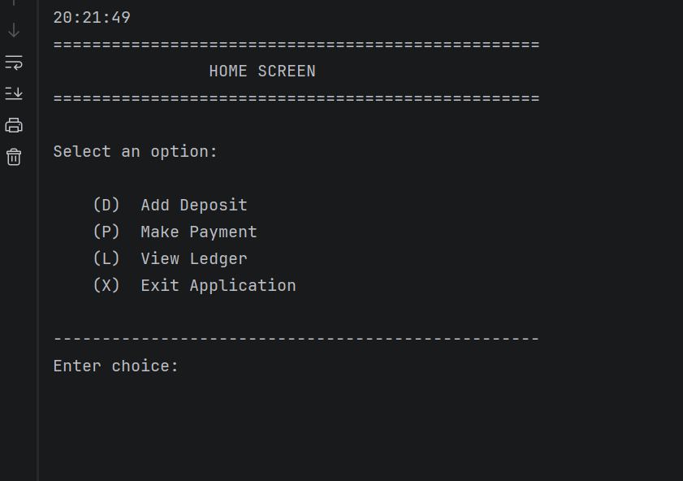
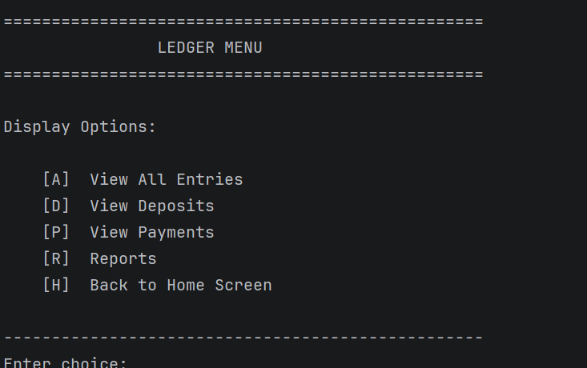
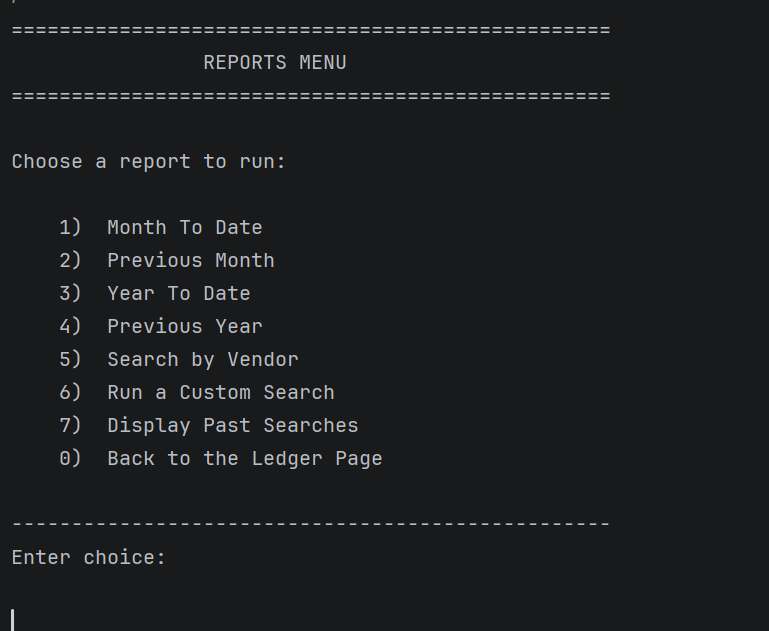
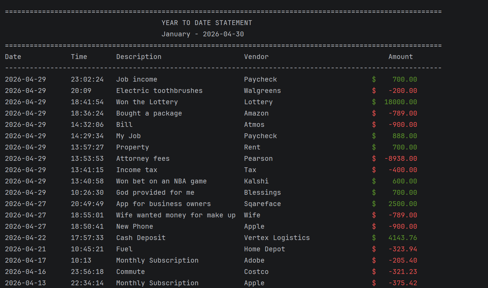

# 💰 Financial Tracker CLI

A professional Java-based command-line application for managing financial transactions, generating reports, and reusing saved search filters.

---

## 🚀 Demo






---

## 📌 Features

- ➕ Add deposits  
- ➖ Record payments  
- 📖 View ledger:
  - All entries
  - Deposits only
  - Payments only  
- 📊 Generate reports:
  - Month-to-Date
  - Previous Month
  - Year-to-Date
  - Previous Year
  - Vendor-specific reports
  - Custom search filters  
- 🔁 Reuse past searches  
- 💾 Persistent storage using CSV files  
- 🎨 Clean, styled terminal UI with:
  - aligned tables
  - color-coded values
  - dynamic borders
  - indexed selections  

---

## 🧠 How It Works

The application loads data from CSV files into memory at startup:

- `transactions.csv` → stores all financial records  
- `searches.csv` → stores previous search filters  

Data is:
- parsed into objects  
- sorted by most recent  
- displayed in formatted tables  

---

## 🏗️ Project Structure

```plaintext
com.pluralsight
│
├── App.java           # Main application + menus
├── Transaction.java   # Transaction model
└── Search.java        # Search model

```

Author: Naod Asmelash

Email: naodd43@gmail.com
